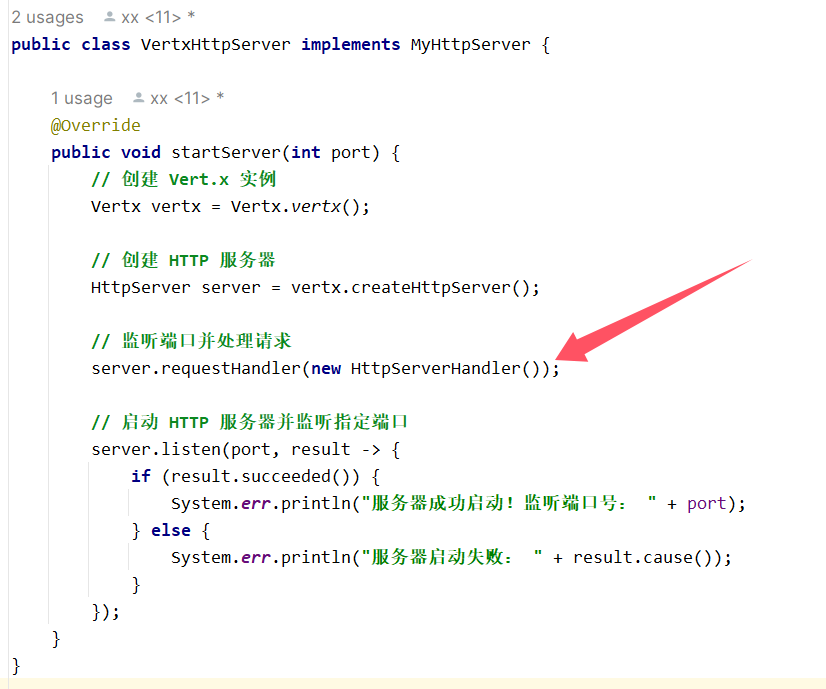

# rpc

## 一、简易版rpc

主要包含以下几个模块：

- common：内含一个通用实体类`User`(用作测试)和通用接口`UserService`
- provider：拥有接口实现类`UserServiceImpl`，启动类为`EasyProvider`
- consumer：主类`EasyConsumer`调用`UserService`的`getUser`方法
- easyrpc：rpc框架的核心

### easyrpc模块提供服务器实现类

==easyrpc==模块的server目录下新建`MyHttpServer`接口

~~~java
/**
 * 自定义Http服务接口
 */
public interface MyHttpServer {

    /**
     * 启动服务器
     * @param port
     */
    void startServer(int port);
}
~~~

==easyrpc==模块中基于Vert.x实现web服务器`VertxHttpServer`

~~~java
public class VertxHttpServer implements MyHttpServer {

    @Override
    public void startServer(int port) {
        // 创建 Vert.x 实例
        Vertx vertx = Vertx.vertx();

        // 创建 HTTP 服务器
        HttpServer server = vertx.createHttpServer();

        // 监听端口并处理请求
        server.requestHandler(request -> {
            // 处理 HTTP 请求
            System.err.println("接受到请求！请求方法： " + request.method() + " 请求路径：" + request.uri());

            // 发送 HTTP 响应
            request.response()
                    .putHeader("content-type", "text/plain")
                    .end("Vert.x HTTP 服务器响应内容!");
        });

        // 启动 HTTP 服务器并监听指定端口
        server.listen(port, result -> {
            if (result.succeeded()) {
                System.err.println("服务器成功启动！监听端口号： " + port);
            } else {
                System.err.println("服务器启动失败： " + result.cause());
            }
        });
    }
}
~~~

### easyrpc模块提供本地registry中心

`registry`目录下新建`LocalRegistry`类，作为本地注册中心

~~~java
/**
 * 本地注册中心
 */
public class LocalRegistry {

    /**
     * 注册信息存储
     */
    private static final Map<String, Class<?>> map = new ConcurrentHashMap<>();

    /**
     * 注册服务
     *
     * @param serviceName
     * @param implClass
     */
    public static void register(String serviceName, Class<?> implClass) {
        map.put(serviceName, implClass);
    }

    /**
     * 获取服务
     *
     * @param serviceName
     * @return
     */
    public static Class<?> get(String serviceName) {
        return map.get(serviceName);
    }

    /**
     * 删除服务
     *
     * @param serviceName
     */
    public static void remove(String serviceName) {
        map.remove(serviceName);
    }
}
~~~

### easyrpc模块提供序列化

> [!CAUTION]
>
> **序列化**：将Java对象转为字节数组
>
> **反序列化**：将字节数组转为Java对象

在==easyrpc==模块编写`Serializer1`接口

~~~java
/**
 * 序列化器接口
 */
public interface Serializer {

    /**
     * 序列化
     *
     * @param object
     * @param <T>
     * @return
     * @throws IOException
     */
    <T> byte[] serialize(T object) throws IOException;

    /**
     * 反序列化
     *
     * @param bytes
     * @param type
     * @param <T>
     * @return
     * @throws IOException
     */
    <T> T deserialize(byte[] bytes, Class<T> type) throws IOException;
}
~~~

基于Java自带的序列化器实现`JdkSerializer`

~~~java
/**
 * JDK 序列化器
 */
public class JdkSerializer implements Serializer {

    /**
     * 序列化
     *
     * @param object
     * @param <T>
     * @return
     * @throws IOException
     */
    @Override
    public <T> byte[] serialize(T object) throws IOException {
        ByteArrayOutputStream outputStream = new ByteArrayOutputStream();
        ObjectOutputStream objectOutputStream = new ObjectOutputStream(outputStream);
        objectOutputStream.writeObject(object);
        objectOutputStream.close();
        return outputStream.toByteArray();
    }

    /**
     * 反序列化
     *
     * @param bytes
     * @param type
     * @param <T>
     * @return
     * @throws IOException
     */
    @Override
    public <T> T deserialize(byte[] bytes, Class<T> type) throws IOException {
        ByteArrayInputStream inputStream = new ByteArrayInputStream(bytes);
        ObjectInputStream objectInputStream = new ObjectInputStream(inputStream);
        try {
            return (T) objectInputStream.readObject();
        } catch (ClassNotFoundException e) {
            throw new RuntimeException(e);
        } finally {
            objectInputStream.close();
        }
    }
}
~~~

### easyrpc模块编写请求和响应封装类

RPC请求封装类`RpcRequest`

> [!IMPORTANT]
>
> `@Builder`是Lombok提供的注解，允许链式调用`setter()`方法

简单示例：

~~~java
import lombok.Builder;
import lombok.Getter;
import lombok.Setter;

@Getter
@Setter
@Builder
public class Person {
    private String name;
    private int age;
    private String gender;
    
    // Lombok 会自动生成一个静态的 builder() 方法，以及链式调用的 setter 方法
}

// 创建Person类
Person person = Person.builder()
                      .name("John Doe")
                      .age(30)
                      .gender("Male")
                      .build();
~~~

~~~java
/**
 * RPC 请求
 */
@Data
@Builder
@AllArgsConstructor
@NoArgsConstructor
public class RpcRequest implements Serializable {

    /**
     * 服务名称
     */
    private String serviceName;

    /**
     * 方法名称
     */
    private String methodName;

    /**
     * 参数类型列表
     */
    private Class<?>[] parameterTypes;

    /**
     * 参数列表
     */
    private Object[] args;

}
~~~

RPC响应封装类`RpcResponse`

~~~java
/**
 * RPC 响应
 */
@Data
@Builder
@AllArgsConstructor
@NoArgsConstructor
public class RpcResponse implements Serializable {

    /**
     * 响应数据
     */
    private Object data;

    /**
     * 响应数据类型（预留）
     */
    private Class<?> dataType;

    /**
     * 响应信息
     */
    private String message;

    /**
     * 异常信息
     */
    private Exception exception;

}
~~~

### easyrpc模块提供请求处理类

请求处理类业务流程：

> [!IMPORTANT]
>
> 请求处理类业务流程：
>
> 1. 反序列化请求为对象，并从请求对象中获取参数；
> 2. 根据服务名称从本地注册器中获取到对应的服务实现类；
> 3. 通过反射机制调用方法，得到返回结果；
> 4. 对返回结果进行封装和序列化，并写入到响应中

~~~java
/**
 * HTTP 请求处理
 */
public class HttpServerHandler implements Handler<HttpServerRequest> {

    @Override
    public void handle(HttpServerRequest request) {
        // 指定序列化器
        final Serializer serializer = new JdkSerializer();

        // 记录日志
        System.out.println("Received request: " + request.method() + " " + request.uri());

        // 异步处理 HTTP 请求
        request.bodyHandler(body -> {
            byte[] bytes = body.getBytes();
            RpcRequest rpcRequest = null;
            try {
                rpcRequest = serializer.deserialize(bytes, RpcRequest.class);
            } catch (Exception e) {
                e.printStackTrace();
            }

            // 构造响应结果对象
            RpcResponse rpcResponse = new RpcResponse();
            // 如果请求为 null，直接返回
            if (rpcRequest == null) {
                rpcResponse.setMessage("rpcRequest is null");
                doResponse(request, rpcResponse, serializer);
                return;
            }

            try {
                // 获取要调用的服务实现类，通过反射调用
                Class<?> implClass = LocalRegistry.get(rpcRequest.getServiceName());
                Method method = implClass.getMethod(rpcRequest.getMethodName(), rpcRequest.getParameterTypes());
                Object result = method.invoke(implClass.newInstance(), rpcRequest.getArgs());
                // 封装返回结果
                rpcResponse.setData(result);
                rpcResponse.setDataType(method.getReturnType());
                rpcResponse.setMessage("ok");
            } catch (Exception e) {
                e.printStackTrace();
                rpcResponse.setMessage(e.getMessage());
                rpcResponse.setException(e);
            }
            // 响应
            doResponse(request, rpcResponse, serializer);
        });
    }

    /**
     * 响应
     *
     * @param request
     * @param rpcResponse
     * @param serializer
     */
    void doResponse(HttpServerRequest request, RpcResponse rpcResponse, Serializer serializer) {
        HttpServerResponse httpServerResponse = request.response()
                .putHeader("content-type", "application/json");
        try {
            // 序列化
            byte[] serialized = serializer.serialize(rpcResponse);
            httpServerResponse.end(Buffer.buffer(serialized));
        } catch (IOException e) {
            e.printStackTrace();
            httpServerResponse.end(Buffer.buffer());
        }
    }
}
~~~

替换`VertxHttpServer`服务器实现类中的**请求处理器**

变为如下：

### provider模块提供UserService实现类

~~~java
/**
 * 用户服务实现类
 */
public class UserServiceImpl implements UserService {
    @Override
    public User getUser(User user) {
        System.out.println("用户名： " + user.getName());
        return user;
    }
}
~~~

### provider模块提供web功能

`provider`需要启动web服务，此处使用Vert.x

~~~java
/**
 * 简易服务提供者示例
 */
public class EasyProvider {

    public static void main(String[] args){
        // 注册服务
        LocalRegistry.register(UserService.class.getName(),UserServiceImpl.class);

        // 提供web服务
        MyHttpServer httpServer = new VertxHttpServer();
        httpServer.startServer(8080);
    }
}
~~~

### consumer模块编写代理

> [!IMPORTANT]
>
> 代理分为**静态代理**和**动态代理**

**静态代理**：使用hutool构造http请求，写在**consumer模块**中

~~~java
/**
 * 静态代理
 */
public class UserServiceStaticProxy implements UserService {

    @Override
    public User getUser(User user) {
        // 指定序列化器
        Serializer serializer = new JdkSerializer();

        // 发请求
        RpcRequest rpcRequest = RpcRequest.builder()
                .serviceName(UserService.class.getName())
                .methodName("getUser")
                .parameterTypes(new Class[]{User.class})
                .args(new Object[]{user})
                .build();
        try {
            byte[] bodyBytes = serializer.serialize(rpcRequest);
            byte[] result;
            try (HttpResponse httpResponse = HttpRequest.post("http://localhost:8080")
                    .body(bodyBytes)
                    .execute()) {
                result = httpResponse.bodyBytes();
            }
            RpcResponse rpcResponse = serializer.deserialize(result, RpcResponse.class);
            return (User) rpcResponse.getData();
        } catch (IOException e) {
            e.printStackTrace();
        }

        return null;
    }
}
~~~

> [!IMPORTANT]
>
> **动态代理**：需要实现 InvocationHandler 接口的 invoke 方法，当用户调用某个接口的方法时，会改为调用 invoke 方法，写在**easyrpc模块**中

首先编写**动态工厂代理类`ServiceProxyFactory`**，以便根据指定类**动态创建对象**

~~~java
/**
 * 服务代理工厂（用于创建代理对象）
 */
public class ServiceProxyFactory {

    /**
     * 根据服务类获取代理对象
     *
     * @param serviceClass
     * @param <T>
     * @return
     */
    public static <T> T getProxy(Class<T> serviceClass) {
        return (T) Proxy.newProxyInstance(
                serviceClass.getClassLoader(),
                new Class[]{serviceClass},
                new ServiceDynamicProxy());
    }
}
~~~

~~~java
/**
 * 服务代理（JDK 动态代理）
 */
public class ServiceDynamicProxy implements InvocationHandler {

    /**
     * 调用代理
     *
     * @return
     * @throws Throwable
     */
    @Override
    public Object invoke(Object proxy, Method method, Object[] args) throws Throwable {
        // 指定序列化器
        Serializer serializer = new JdkSerializer();
        System.out.println("消费者指定的序列化器为：" + serializer);

        // 构造请求
        RpcRequest rpcRequest = RpcRequest.builder()
                .serviceName(method.getDeclaringClass().getName())
                .methodName(method.getName())
                .parameterTypes(method.getParameterTypes())
                .args(args)
                .build();
        try {
            // 序列化
            byte[] bodyBytes = serializer.serialize(rpcRequest);
            // 发送请求
            // todo 注意，这里地址被硬编码了（需要使用注册中心和服务发现机制解决）
            try (HttpResponse httpResponse = HttpRequest.post("http://localhost:8080")
                    .body(bodyBytes)
                    .execute()) {
                byte[] result = httpResponse.bodyBytes();
                // 反序列化
                RpcResponse rpcResponse = serializer.deserialize(result, RpcResponse.class);
                return rpcResponse.getData();
            }
        } catch (IOException e) {
            e.printStackTrace();
        }

        return null;
    }
}
~~~

### consumer调用服务

~~~java
/**
 * 服务消费者示例
 */
public class EasyConsumer {

    public static void main(String[] args){

        // 静态代理
        UserService userService1 = new UserServiceStaticProxy();
        User user1 = new User();
        user1.setName("静态代理！");
        userService1.getUser(user1);

        // 动态代理
        UserService userService2 = ServiceProxyFactory.getProxy(UserService.class);
        User user2 = new User();
        user2.setName("动态代理");
        userService2.getUser(user2);
    }
}
~~~

### debug

- debug`EasyProvider`
- debug`EasyConsumer`

### trick

**反射调用方法步骤**

> [!IMPORTANT]
>
> 1. `Class<?> implClass = ?`获取全类名，比如`com.xx.service.userServiceImpl`
> 2. `Method method = implClass.getMethod(方法名, 参数类型)`获取反射类的方法
> 3. `method.invoke(反射类全类名.newInstance(), 方法参数)` ，用invoke调用反射类的方法，返回值为**Object**类型

~~~java
Class<?> implClass = LocalRegistry.get(rpcRequest.getServiceName());
Method method = implClass.getMethod(rpcRequest.getMethodName(), rpcRequest.getParameterTypes());
Object result = method.invoke(implClass.newInstance(), rpcRequest.getArgs());
~~~

## 二、完善全局配置加载

> [!CAUTION]
>
> 新建`xx-rpc-core`模块

### 在config包下新建配置类`RpcConfig`

> [!NOTE]
>
> **保存配置信息**

~~~java
/**
 * RPC 框架配置
 */
@Data
public class RpcConfig {

    /**
     * 名称
     */
    private String name = "xx-rpc";

    /**
     * 版本号
     */
    private String version = "1.0";

    /**
     * 服务器主机名
     */
    private String serverHost = "localhost";
    
    /**
     * 服务器端口号
     */
    private Integer serverPort = 8080;

}
~~~

### 在utils包下新建工具类`ConfigUtils`

> [!NOTE]
>
> **读取配置文件**并**返回配置对象**

~~~java
/**
 * 配置工具类
 */
public class ConfigUtils {

    /**
     * 加载配置对象
     *
     * @param tClass
     * @param prefix
     * @param <T>
     * @return
     */
    public static <T> T loadConfig(Class<T> tClass, String prefix) {
        return loadConfig(tClass, prefix, "");
    }

    /**
     * 加载配置对象，支持区分环境
     *
     * @param tClass
     * @param prefix
     * @param environment
     * @param <T>
     * @return
     */
    public static <T> T loadConfig(Class<T> tClass, String prefix, String environment) {
        StringBuilder configFileBuilder = new StringBuilder("application");
        if (StrUtil.isNotBlank(environment)) {
            configFileBuilder.append("-").append(environment);
        }
        configFileBuilder.append(".properties");
        Props props = new Props(configFileBuilder.toString());
        return props.toBean(tClass, prefix);
    }
}
~~~

### 在constant包下新建`RpcConstant`接口

> [!NOTE]
>
> **存储RPC相关的常量**

~~~java
/**
 * RPC 相关常量
 */
public interface RpcConstant {

    /**
     * 默认配置文件加载前缀
     */
    String DEFAULT_CONFIG_PREFIX = "rpc";

}
~~~

### 新建RpcApplcation作为RPC项目的启动入口

> [!IMPORTANT]
>
> RPC框架需要维护一个**全局的配置对象**，以免反复加载配置，这就是**单例模式**，下面的示例是**双检单例模式**
>
> 之后，在RPC框架内，只需要写下面一行代码，就能加载到配置

~~~java
RpcConfig rpc = RpcApplication.getRpcConfig();
~~~

当一个线程修改了 `rpcConfig` 的值，新值对于其他线程来说是立即可见的。没有 `volatile` 关键字，可能会发生一个线程看到了变量的旧值，因为变量值可能被缓存在寄存器或者线程栈中。

~~~java
/**
 * RPC 框架应用
 * 相当于 holder，存放了项目全局用到的变量。双检锁单例模式实现
 */
@Slf4j
public class RpcApplication {

    // 轻量级的同步机制
    private static volatile RpcConfig rpcConfig;

    /**
     * 框架初始化，支持传入自定义配置
     *
     * @param newRpcConfig
     */
    public static void init(RpcConfig newRpcConfig) {
        rpcConfig = newRpcConfig;
        log.info("rpc init, config = {}", newRpcConfig.toString());
    }

    /**
     * 初始化
     */
    public static void init() {
        RpcConfig newRpcConfig;
        try {
            newRpcConfig = ConfigUtils.loadConfig(RpcConfig.class, RpcConstant.DEFAULT_CONFIG_PREFIX);
        } catch (Exception e) {
            // 配置加载失败，使用默认值
            newRpcConfig = new RpcConfig();
        }
        init(newRpcConfig);
    }

    /**
     * 获取配置
     *
     * @return
     */
    public static RpcConfig getRpcConfig() {
        if (rpcConfig == null) {
            synchronized (RpcApplication.class) {
                if (rpcConfig == null) {
                    init();
                }
            }
        }
        return rpcConfig;
    }
}
~~~

### provider动态加载配置

> [!WARNING]
>
> - `RpcApplication.init();`只能读取默认的配置，在RPC框架的代码中，默认的前缀为rpc，即只有provider的application.properties文件中编写的配置是以rpc.xxx才能被正确加载，否则框架将全部加载默认配置
>
> - 加载自定义配置信息，代码如下，先构造rpcConfig对象，后调用init()进行初始化
>
>   ~~~java
>   // 测试动态加载配置，该模块的application.properties文件会覆盖corerpc模块中的application.properties文件
>   RpcConfig rpcConfig = ConfigUtils.loadConfig(RpcConfig.class, "yy");
>   RpcApplication.init(rpcConfig);
>   ~~~

~~~java
/**
 * 全局配置加载服务提供者示例
 */
public class ProviderGlobalSetting {

    public static void main(String[] args) {
        // RPC 框架初始化,默认初始化
        RpcApplication.init();

        // 注册服务
        LocalRegistry.register(UserService.class.getName(), UserServiceImpl.class);

        // 启动 web 服务
        HttpServer httpServer = new VertxHttpServer();
        httpServer.startServer(RpcApplication.getRpcConfig().getServerPort());
    }
}
~~~

## 三、接口Mock

### 在RpcConfig配置类中新增mock字段

> [!IMPORTANT]
>
> 对于`boolean`类型的变量，lombok会自动生成==isXxx()==方法用来判断`true`**or**`false`，比如：isMock()方法

~~~java
/**
 * 模拟调用
 */
private boolean mock = false;
~~~

在**xx-rpc-core模块**的proxy包下新建MockServiceProxy代理类

> [!NOTE]
>
> 代理类实现原理：
>
> 通过反射方法method.getReturnType()获取返回类型，通过匹配返回类型构造返回值

~~~java
/**
 * Mock 服务代理（JDK动态代理）
 */
@Slf4j
public class MockServiceProxy implements InvocationHandler {

    /**
     * 调用代理
     * @param proxy the proxy instance that the method was invoked on
     *
     * @param method the {@code Method} instance corresponding to
     * the interface method invoked on the proxy instance.  The declaring
     * class of the {@code Method} object will be the interface that
     * the method was declared in, which may be a superinterface of the
     * proxy interface that the proxy class inherits the method through.
     *
     * @param args an array of objects containing the values of the
     * arguments passed in the method invocation on the proxy instance,
     * or {@code null} if interface method takes no arguments.
     * Arguments of primitive types are wrapped in instances of the
     * appropriate primitive wrapper class, such as
     * {@code java.lang.Integer} or {@code java.lang.Boolean}.
     *
     * @return
     * @throws Throwable
     */
    @Override
    public Object invoke(Object proxy, Method method, Object[] args) throws Throwable{
        // 根据方法的返回值类型，生成特定的默认值对象
        Class<?> methodReturnType = method.getReturnType();
        log.info("mock invoke {}", method.getName());
        return getDefaultObject(methodReturnType);
    }

    /**
     * 生成指定类型的默认值对象
     * @param type
     * @return
     */
    private Object getDefaultObject(Class<?> type){
        // 检查是否为基本数据类型
        if(type.isPrimitive()){
            if(type == boolean.class){
                return false;
            }else if(type == short.class){
                return (short)0;
            }else if(type == int.class){
                return 0;
            }else if(type == long.class){
                return 0L;
            }
        }
        return null;
    }
}
~~~

### ServiceProxyFactory新增判断mock接口逻辑

~~~java
/**
 * 服务代理工厂（用于创建代理对象）
 */
public class ServiceProxyFactory {

    /**
     * 根据服务类获取代理对象
     *
     * @param serviceClass
     * @param <T>
     * @return
     */
    public static <T> T getProxy(Class<T> serviceClass) {

        if(RpcApplication.getRpcConfig().isMock()){
            return getMockProxy(serviceClass);
        }
//        ClassLoader：用于定义代理类的类加载器。
//        Class[]：一个类数组，指定代理对象要实现的接口。
//        InvocationHandler：一个调用处理器，用于处理对代理对象方法的调用。

      // 使用http
        return (T) Proxy.newProxyInstance(
                serviceClass.getClassLoader(),
                new Class[]{serviceClass},
                new ServiceProxyUseHttp());

    /**
     * 根据服务类获取Mock代理对象
     * @param serviceClass
     * @return
     * @param <T>
     */
    public static <T> T getMockProxy(Class<T> serviceClass){
        return (T)Proxy.newProxyInstance(
                serviceClass.getClassLoader(),
                new Class[]{serviceClass},
                new MockServiceProxy()
        );
    }
}
~~~

## 四、序列化器与SPI机制

> [!NOTE]
>
> SPI机制：SPI（Service Provider Interface）服务提供接口是 Java 的机制，主要用于实现模块化开发和插件化扩展。
>
> 一个典型的 SPI 应用场景是 JDBC（Java 数据库连接库），不同的数据库驱动程序开发者可以使用 JDBC 库，然后定制自己的数据库驱动程序

### xx-rpc-core模块提供多种序列化器实现

- Json序列化器
- Kyro序列化器
- Hession序列化器

补充序列化器名称常量：

~~~java
/**
 * 序列化器键名
 */
public interface SerializerKeys {

    String JDK = "jdk";
    String JSON = "json";
    String KRYO = "kryo";
    String HESSIAN = "hessian";

}
~~~

### xx-rpc-core模块提供序列化器工厂

~~~java
/**
 * 序列化器工厂（用于获取序列化器对象）
 */
public class SerializerFactory {

    static {
        SpiLoader.load(Serializer.class);
    }

    /**
     * 默认序列化器
     */
    private static final Serializer DEFAULT_SERIALIZER = new JdkSerializer();

    /**
     * 获取实例
     *
     * @param key
     * @return
     */
    public static Serializer getInstance(String key) {
        return SpiLoader.getInstance(Serializer.class, key);
    }

}
~~~

### xx-rpc-core模块的全局配置类RpcConfig补充序列化器配置

~~~java
/**
 * 序列化器
 */
private String serializer = SerializerKeys.JDK
~~~

### 实现SPI机制

在resources/META-INF/rpc/**custom**目录下新建文件`com.xx.corerpc.serializer.Serializer`

填写如下配置：

~~~java
hessian=com.xx.corerpc.serializer.HessianSerializer
json=com.xx.corerpc.serializer.JsonSerializer
kryo=com.xx.corerpc.serializer.KryoSerializer
~~~

在在resources/META-INF/rpc/**system**目录下新建文件`com.xx.corerpc.serializer.Serializer`

填写如下配置：

~~~java
jdk=com.xx.corerpc.serializer.JdkSerializer
~~~

**编写SpiLoader加载器**

在spi包下新建SpiLoader类：

> [!NOTE]
>
> 1. 用 Map 来存储已加载的配置信息 键名 => 实现类。
> 2. 扫描指定路径，读取每个配置文件，获取到 键名 => 实现类 信息并存储在 Map 中。
> 3. 定义获取实例方法，根据用户传入的接口和键名，从 Map 中找到对应的实现类，然后通过反射获取到实现类对象。
> 4. 可以维护一个对象实例缓存，创建过一次的对象从缓存中读取即可。

~~~java
/**
 * SPI 加载器（支持键值对映射）
 */
@Slf4j
public class SpiLoader {

    /**
     * 存储已加载的类：接口名 =>（key => 实现类）
     */
    private static Map<String, Map<String, Class<?>>> loaderMap = new ConcurrentHashMap<>();

    /**
     * 对象实例缓存（避免重复 new），类路径 => 对象实例，单例模式
     */
    private static Map<String, Object> instanceCache = new ConcurrentHashMap<>();

    /**
     * 系统 SPI 目录
     */
    private static final String RPC_SYSTEM_SPI_DIR = "META-INF/rpc/system/";

    /**
     * 用户自定义 SPI 目录
     */
    private static final String RPC_CUSTOM_SPI_DIR = "META-INF/rpc/custom/";

    /**
     * 扫描路径
     */
    private static final String[] SCAN_DIRS = new String[]{RPC_SYSTEM_SPI_DIR, RPC_CUSTOM_SPI_DIR};

    /**
     * 动态加载的类列表
     */
    private static final List<Class<?>> LOAD_CLASS_LIST = Arrays.asList(Serializer.class);

    /**
     * 加载所有类型
     */
    public static void loadAll() {
        log.info("加载所有 SPI");
        for (Class<?> aClass : LOAD_CLASS_LIST) {
            load(aClass);
        }
    }

    /**
     * 获取某个接口的实例
     *
     * @param tClass
     * @param key
     * @param <T>
     * @return
     */
    public static <T> T getInstance(Class<?> tClass, String key) {
        String tClassName = tClass.getName();
        Map<String, Class<?>> keyClassMap = loaderMap.get(tClassName);
        if (keyClassMap == null) {
            throw new RuntimeException(String.format("SpiLoader 未加载 %s 类型", tClassName));
        }
        if (!keyClassMap.containsKey(key)) {
            throw new RuntimeException(String.format("SpiLoader 的 %s 不存在 key=%s 的类型", tClassName, key));
        }
        // 获取到要加载的实现类型
        Class<?> implClass = keyClassMap.get(key);
        // 从实例缓存中加载指定类型的实例
        String implClassName = implClass.getName();
        if (!instanceCache.containsKey(implClassName)) {
            try {
                instanceCache.put(implClassName, implClass.newInstance());
            } catch (InstantiationException | IllegalAccessException e) {
                String errorMsg = String.format("%s 类实例化失败", implClassName);
                throw new RuntimeException(errorMsg, e);
            }
        }
        System.out.println("SPI加载的实例为" + implClassName);
        return (T) instanceCache.get(implClassName);
    }

    /**
     * 加载某个类型
     *
     * @param loadClass
     * @throws IOException
     */
    public static Map<String, Class<?>> load(Class<?> loadClass) {
        log.info("加载类型为 {} 的 SPI", loadClass.getName());
        // 扫描路径，用户自定义的 SPI 优先级高于系统 SPI
        Map<String, Class<?>> keyClassMap = new HashMap<>();
        for (String scanDir : SCAN_DIRS) {
            List<URL> resources = ResourceUtil.getResources(scanDir + loadClass.getName());
            // 读取每个资源文件
            for (URL resource : resources) {
                try {
                    InputStreamReader inputStreamReader = new InputStreamReader(resource.openStream());
                    BufferedReader bufferedReader = new BufferedReader(inputStreamReader);
                    String line;
                    while ((line = bufferedReader.readLine()) != null) {
                        String[] strArray = line.split("=");
                        if (strArray.length > 1) {
                            String key = strArray[0];
                            String className = strArray[1];
                            keyClassMap.put(key, Class.forName(className));
                        }
                    }
                } catch (Exception e) {
                    log.error("spi resource load error", e);
                }
            }
        }
        loaderMap.put(loadClass.getName(), keyClassMap);
        return keyClassMap;
    }
}
~~~

## 五、注册中心实现(etcd)

etcd下载地址：https://etcd.io/docs/v3.2/install/

etcd可视化：https://github.com/evildecay/etcdkeeper/

etcdkeeper启动指令：`./etcdkeeper -p 8081`

之后访问本地http://127.0.0.1:8081/etcdkeeper/

etcd Java客户端依赖：

~~~xml
<!-- https://mvnrepository.com/artifact/io.etcd/jetcd-core -->
<dependency>
    <groupId>io.etcd</groupId>
    <artifactId>jetcd-core</artifactId>
    <version>0.7.7</version>
</dependency>
~~~

### 在model包下新建ServiceMetaInfo类

~~~java
/**
 * 服务元信息（注册信息）
 */
@Data
public class ServiceMetaInfo {

    /**
     * 服务名称
     */
    private String serviceName;

    /**
     * 服务版本号
     */
    private String serviceVersion = "1.0";

    /**
     * 服务域名
     */
    private String serviceHost;

    /**
     * 服务端口号
     */
    private Integer servicePort;

    /**
     * 服务分组（暂未实现）
     */
    private String serviceGroup = "default";

    /**
     * 获取服务键名
     *
     * @return
     */
    public String getServiceKey() {
        // 后续可扩展服务分组
        // return String.format("%s:%s:%s", serviceName, serviceVersion, serviceGroup);
        return String.format("%s:%s", serviceName, serviceVersion);
    }

    /**
     * 获取服务注册节点键名
     *
     * @return
     */
    public String getServiceNodeKey() {
        return String.format("%s/%s:%s", getServiceKey(), serviceHost, servicePort);
    }

    /**
     * 获取完整服务地址
     *
     * @return
     */
    public String getServiceAddress() {
        if (!StrUtil.contains(serviceHost, "http")) {
            return String.format("http://%s:%s", serviceHost, servicePort);
        }
        return String.format("%s:%s", serviceHost, servicePort);
    }
}
~~~

将ServiceMetaInfo添加到RpcRequest请求封装类中：

~~~java
 /**
  * 服务版本(后续注册中心将会使用)
 */
private String serviceVersion = RpcConstant.DEFAULT_SERVICE_VERSION;
~~~

将服务版本号字段进行抽象，抽取为常量保存在RpcConstant中：

~~~java
/**
 * RPC 相关常量
 */
public interface RpcConstant {

    /**
     * 默认配置文件加载前缀
     */
    String DEFAULT_CONFIG_PREFIX = "rpc";

    /**
     * 默认服务版本
     */
    String DEFAULT_SERVICE_VERSION = "1.0";
}
~~~

### 在config包下新建RegistryConfig配置类

~~~java
/**
 * RPC 框架注册中心配置
 */
@Data
public class RegistryConfig {

    /**
     * 注册中心类别
     */
    private String registry = "etcd";

    /**
     * 注册中心地址
     */
    private String address = "http://localhost:2380";

    /**
     * 用户名
     */
    private String username;

    /**
     * 密码
     */
    private String password;

    /**
     * 超时时间（单位毫秒）
     */
    private Long timeout = 10000L;
}
~~~

将RegistryConfig添加到RpcConfig全局配置类中：

~~~java
@Data
public class RpcConfig {
    ...
    
    /**
     * 注册中心配置
     */
    private RegistryConfig registryConfig = new RegistryConfig();
}
~~~

### 编写注册中心接口

~~~java
/**
 * 注册中心
 *
 */
public interface Registry {

    /**
     * 初始化
     *
     * @param registryConfig
     */
    void init(RegistryConfig registryConfig);

    /**
     * 注册服务（服务端）
     *
     * @param serviceMetaInfo
     */
    void register(ServiceMetaInfo serviceMetaInfo) throws Exception;

    /**
     * 注销服务（服务端）
     *
     * @param serviceMetaInfo
     */
    void unRegister(ServiceMetaInfo serviceMetaInfo);

    /**
     * 服务发现（获取某服务的所有节点，消费端）
     *
     * @param serviceKey 服务键名
     * @return
     */
    List<ServiceMetaInfo> serviceDiscovery(String serviceKey);

    /**
     * 服务销毁
     */
    void destroy();

    /**
     * 心跳检测（服务端）
     */
    void heartBeat();

    /**
     * 监听（消费端）
     *
     * @param serviceNodeKey
     */
    void watch(String serviceNodeKey);
}
~~~

### 编写EtcdRegistry实现注册中心接口

~~~java
public class EtcdRegistry implements Registry {

    private Client client;

    private KV kvClient;

    /**
     * 本机注册的节点 key 集合（用于维护续期）
     */
    private final Set<String> localRegisterNodeKeySet = new HashSet<>();

    /**
     * 注册中心服务缓存
     */
    private final RegistryServiceCache registryServiceCache = new RegistryServiceCache();

    /**
     * 正在监听的 key 集合
     */
    private final Set<String> watchingKeySet = new ConcurrentHashSet<>();

    /**
     * 根节点
     */
    private static final String ETCD_ROOT_PATH = "/rpc/";

    @Override
    public void init(RegistryConfig registryConfig) {

        System.err.println("调用RegistryConfig初始化方法！");

        client = Client.builder()
                .endpoints(registryConfig.getAddress())
                .connectTimeout(Duration.ofMillis(registryConfig.getTimeout()))
                .build();
        kvClient = client.getKVClient();
        // 开启心跳检测定时任务
        System.out.println("心跳机制即将开启！");
        heartBeat();
        System.out.println("心跳机制成功启用！");
    }

    @Override
    public void register(ServiceMetaInfo serviceMetaInfo) throws Exception {

        System.err.println("调用服务注册方法！");

        // 创建 Lease 和 KV 客户端
        Lease leaseClient = client.getLeaseClient();

        // 创建一个 30 秒的租约
        long leaseId = leaseClient.grant(30).get().getID();

        // 设置要存储的键值对
        String registerKey = ETCD_ROOT_PATH + serviceMetaInfo.getServiceNodeKey();
        ByteSequence key = ByteSequence.from(registerKey, StandardCharsets.UTF_8);
        ByteSequence value = ByteSequence.from(JSONUtil.toJsonStr(serviceMetaInfo), StandardCharsets.UTF_8);

        // 将键值对与租约关联起来，并设置过期时间
        PutOption putOption = PutOption.builder().withLeaseId(leaseId).build();
        kvClient.put(key, value, putOption).get();

        // 添加节点信息到本地缓存
        localRegisterNodeKeySet.add(registerKey);
        System.err.println("成功将" + registerKey + "添加到本地缓存！");
    }
    @Override
    public void unRegister(ServiceMetaInfo serviceMetaInfo) {

        System.err.println("调用服务注册方法！");

        String registerKey = ETCD_ROOT_PATH + serviceMetaInfo.getServiceNodeKey();
        kvClient.delete(ByteSequence.from(registerKey, StandardCharsets.UTF_8));
        // 也要从本地缓存移除
        localRegisterNodeKeySet.remove(registerKey);

        System.err.println("服务注销！" + registerKey + "从本地缓存移除！");
    }

    @Override
    public List<ServiceMetaInfo> serviceDiscovery(String serviceKey) {

        System.err.println("调用服务发现方法！！！");

        // 优先从缓存获取服务
        List<ServiceMetaInfo> cachedServiceMetaInfoList = registryServiceCache.readCache();
        if (cachedServiceMetaInfoList != null) {
            System.err.println("成功从缓存获取服务信息！！！");
            return cachedServiceMetaInfoList;
        }else{
            System.err.println("缓存没有服务相关信息！！！");
        }

        // 前缀搜索，结尾一定要加 '/'
        String searchPrefix = ETCD_ROOT_PATH + serviceKey + "/";

        try {
            // 前缀查询
            GetOption getOption = GetOption.builder().isPrefix(true).build();
            List<KeyValue> keyValues = kvClient.get(
                            ByteSequence.from(searchPrefix, StandardCharsets.UTF_8),
                            getOption)
                    .get()
                    .getKvs();
            // 解析服务信息
            List<ServiceMetaInfo> serviceMetaInfoList = keyValues.stream()
                    .map(keyValue -> {
                        String key = keyValue.getKey().toString(StandardCharsets.UTF_8);
                        // 监听 key 的变化
                        watch(key);
                        String value = keyValue.getValue().toString(StandardCharsets.UTF_8);
                        return JSONUtil.toBean(value, ServiceMetaInfo.class);
                    })
                    .collect(Collectors.toList());

            // 写入服务缓存
            registryServiceCache.writeCache(serviceMetaInfoList);

            System.err.println("首次调用，将服务信息写入缓存！！！" + serviceMetaInfoList );

            return serviceMetaInfoList;
        } catch (Exception e) {
            throw new RuntimeException("获取服务列表失败", e);
        }
    }

    @Override
    public void destroy() {
        System.err.println("当前节点下线！！！");
        // 下线节点
        // 遍历本节点所有的 key
        for (String key : localRegisterNodeKeySet) {
            try {
                kvClient.delete(ByteSequence.from(key, StandardCharsets.UTF_8)).get();
            } catch (Exception e) {
                throw new RuntimeException(key + "节点下线失败");
            }
        }

        // 释放资源
        if (kvClient != null) {
            kvClient.close();
        }
        if (client != null) {
            client.close();
        }
    }

    @Override
    public void heartBeat() {
        // 10 秒续签一次
        CronUtil.schedule("*/10 * * * * *", new Task() {
            @Override
            public void execute() {
                // 遍历本节点所有的 key
                for (String key : localRegisterNodeKeySet) {
                    try {
                        List<KeyValue> keyValues = kvClient.get(ByteSequence.from(key, StandardCharsets.UTF_8))
                                .get()
                                .getKvs();
                        // 该节点已过期（需要重启节点才能重新注册）
                        if (CollUtil.isEmpty(keyValues)) {
                            continue;
                        }
                        // 节点未过期，重新注册（相当于续签）
                        KeyValue keyValue = keyValues.get(0);
                        String value = keyValue.getValue().toString(StandardCharsets.UTF_8);
                        ServiceMetaInfo serviceMetaInfo = JSONUtil.toBean(value, ServiceMetaInfo.class);
                        register(serviceMetaInfo);
                        System.err.println("续签服务调用！！！");
                    } catch (Exception e) {
                        throw new RuntimeException(key + "续签失败", e);
                    }
                }
            }
        });

        // 支持秒级别定时任务
        CronUtil.setMatchSecond(true);
        CronUtil.start();
    }

    /**
     * 监听（消费端）
     *
     * @param serviceNodeKey
     */
    @Override
    public void watch(String serviceNodeKey) {
        Watch watchClient = client.getWatchClient();
        // 之前未被监听，开启监听
        boolean newWatch = watchingKeySet.add(serviceNodeKey);
        if (newWatch) {
            System.err.println("监听 " + serviceNodeKey + " !!!");
            watchClient.watch(ByteSequence.from(serviceNodeKey, StandardCharsets.UTF_8), response -> {
                for (WatchEvent event : response.getEvents()) {
                    switch (event.getEventType()) {
                        // key 删除时触发
                        case DELETE:
                            // 清理注册服务缓存
                            System.err.println("检测到key删除操作！！！ key：" + serviceNodeKey);
                            registryServiceCache.clearCache();
                            break;
                        case PUT:
                        default:
                            break;
                    }
                }
            });
        }
    }

}
~~~

新建RegistryKeys类，保存框架支持的注册中心键名

~~~java
/**
 * 注册中心键名常量
 */
public interface RegistryKeys {

    String ETCD = "etcd";

    String ZOOKEEPER = "zookeeper";

}
~~~

### 新建注册中心工厂类EtcdRegistryFactory

参照之前的序列化器工厂，可以通过SPI机制实现动态加载

~~~java
/**
 * 注册中心工厂（用于获取注册中心对象）
 *
 */
public class RegistryFactory {

    static {
        SpiLoader.load(Registry.class);
    }

    /**
     * 默认注册中心
     */
    private static final Registry DEFAULT_REGISTRY = new EtcdRegistry();

    /**
     * 获取实例
     *
     * @param key
     * @return
     */
    public static Registry getInstance(String key) {
        return SpiLoader.getInstance(Registry.class, key);
    }

}
~~~

同时，在`resoruces/META-INF/system`目录下编写注册中心的SPI配置文件

配置文件内容如下：

~~~xml
etcd=com.xx.corerpc.registry.EtcdRegistry
zookeeper=com.xx.corerpc.registry.ZookeeperRegistry
~~~

### 修改启动类RpcApplication代码

> [!IMPORTANT]
>
> 在rpc框架的启动类中添加**初始化注册中心**的逻辑

修改`init()`方法：

~~~java
/**
 * 框架初始化，支持传入自定义配置
 *
 * @param newRpcConfig
 */
public static void init(RpcConfig newRpcConfig) {
    rpcConfig = newRpcConfig;
    log.info("rpc init, config = {}", newRpcConfig.toString());
    // 注册中心初始化
    RegistryConfig registryConfig = rpcConfig.getRegistryConfig();
    Registry registry = RegistryFactory.getInstance(registryConfig.getRegistry());
    registry.init(registryConfig);
    log.info("registry init, config = {}", registryConfig);
}
~~~

修改服务代理类的调用服务逻辑：

修改前如下：

请求地址写死

修改后：

从注册中心获取服务地址

### provider模块编写EtcdRegistryProvider类

~~~java
/**
 * etcd服务提供者示例
 *
 */
public class EtcdRegistryProvider {

    public static void main(String[] args) {
        // RPC 框架初始化
        System.err.println("RPC框架开始初始化！！！");
        RpcApplication.init();
        System.err.println("RPC框架初始化成功！！！");

        String serviceName = UserService.class.getName();

        // 注册服务到本地
        LocalRegistry.register(serviceName, UserServiceImpl.class);

        // 注册服务到注册中心
        RpcConfig rpcConfig = RpcApplication.getRpcConfig();
        RegistryConfig registryConfig = rpcConfig.getRegistryConfig();
        Registry registry = RegistryFactory.getInstance(registryConfig.getRegistry());
        ServiceMetaInfo serviceMetaInfo = new ServiceMetaInfo();
        serviceMetaInfo.setServiceName(serviceName);
        serviceMetaInfo.setServiceHost(rpcConfig.getServerHost());
        serviceMetaInfo.setServicePort(rpcConfig.getServerPort());
        try {
            registry.register(serviceMetaInfo);
        } catch (Exception e) {
            throw new RuntimeException(e);
        }

        // 启动 web 服务
        MyHttpServer httpServer = new VertxHttpServer();
        httpServer.startServer(RpcApplication.getRpcConfig().getServerPort());
    }
}
~~~

### debug

生产者启动`EtcdRegistryProvider`

消费者启动`SpiConsumer`

## 六、自定义传输协议

### 新建协议消息类`ProtocolMessage`类

~~~java
/**
 * 协议消息结构
 */
@Data
@AllArgsConstructor
@NoArgsConstructor
public class ProtocolMessage<T> {

    /**
     * 消息头
     */
    private Header header;

    /**
     * 消息体（请求或响应对象）
     */
    private T body;

    /**
     * 协议消息头
     */
    @Data
    public static class Header {

        /**
         * 魔数，保证安全性
         */
        private byte magic;

        /**
         * 版本号
         */
        private byte version;

        /**
         * 序列化器
         */
        private byte serializer;

        /**
         * 消息类型（请求 / 响应）
         */
        private byte type;

        /**
         * 状态
         */
        private byte status;

        /**
         * 请求 id
         */
        private long requestId;

        /**
         * 消息体长度
         */
        private int bodyLength;
    }
}
~~~

### 新建协议常量接口`ProtocolConstant`

~~~java
/**
 * 协议常量
 *
 */
public interface ProtocolConstant {

    /**
     * 消息头长度
     */
    int MESSAGE_HEADER_LENGTH = 17;

    /**
     * 协议魔数
     */
    byte PROTOCOL_MAGIC = 0x1;

    /**
     * 协议版本号
     */
    byte PROTOCOL_VERSION = 0x1;
}
~~~

新建消息字段的枚举类`ProtocolMessageStatusEnum`

~~~java
/**
 * 协议消息的状态枚举
 */
@Getter
public enum ProtocolMessageStatusEnum {

    OK("ok", 20),
    BAD_REQUEST("badRequest", 40),
    BAD_RESPONSE("badResponse", 50);

    private final String text;

    private final int value;

    ProtocolMessageStatusEnum(String text, int value) {
        this.text = text;
        this.value = value;
    }

    /**
     * 根据 value 获取枚举
     *
     * @param value
     * @return
     */
    public static ProtocolMessageStatusEnum getEnumByValue(int value) {
        for (ProtocolMessageStatusEnum anEnum : ProtocolMessageStatusEnum.values()) {
            if (anEnum.value == value) {
                return anEnum;
            }
        }
        return null;
    }
}
~~~

### 协议消息类型枚举`ProtocolMessageTypeEnum`

~~~java
/**
 * 协议消息的类型枚举
 *
 */
@Getter
public enum ProtocolMessageTypeEnum {

    REQUEST(0),
    RESPONSE(1),
    HEART_BEAT(2),
    OTHERS(3);

    private final int key;

    ProtocolMessageTypeEnum(int key) {
        this.key = key;
    }

    /**
     * 根据 key 获取枚举
     *
     * @param key
     * @return
     */
    public static ProtocolMessageTypeEnum getEnumByKey(int key) {
        for (ProtocolMessageTypeEnum anEnum : ProtocolMessageTypeEnum.values()) {
            if (anEnum.key == key) {
                return anEnum;
            }
        }
        return null;
    }
}
~~~

### 新建协议消息的序列化器枚举`ProtocolMessageSerializerEnum`

~~~java
/**
 * 协议消息的序列化器枚举
 */
@Getter
public enum ProtocolMessageSerializerEnum {

    JDK(0, "jdk"),
    JSON(1, "json"),
    KRYO(2, "kryo"),
    HESSIAN(3, "hessian");

    private final int key;

    private final String value;

    ProtocolMessageSerializerEnum(int key, String value) {
        this.key = key;
        this.value = value;
    }

    /**
     * 获取值列表
     *
     * @return
     */
    public static List<String> getValues() {
        return Arrays.stream(values()).map(item -> item.value).collect(Collectors.toList());
    }

    /**
     * 根据 key 获取枚举
     *
     * @param key
     * @return
     */
    public static ProtocolMessageSerializerEnum getEnumByKey(int key) {
        for (ProtocolMessageSerializerEnum anEnum : ProtocolMessageSerializerEnum.values()) {
            if (anEnum.key == key) {
                return anEnum;
            }
        }
        return null;
    }

    /**
     * 根据 value 获取枚举
     *
     * @param value
     * @return
     */
    public static ProtocolMessageSerializerEnum getEnumByValue(String value) {
        if (ObjectUtil.isEmpty(value)) {
            return null;
        }
        for (ProtocolMessageSerializerEnum anEnum : ProtocolMessageSerializerEnum.values()) {
            if (anEnum.value.equals(value)) {
                return anEnum;
            }
        }
        return null;
    }
}
~~~

### 实现TCP服务器

新建`VertxTcpServer`类

~~~java
@Slf4j
public class VertxTcpServer implements MyHttpServer {

    private byte[] handleRequest(byte[] requestData) {
        // 在这里编写处理请求的逻辑，根据 requestData 构造响应数据并返回
        // 这里只是一个示例，实际逻辑需要根据具体的业务需求来实现
        return "Hello, client!".getBytes();
    }

    @Override
    public void startServer(int port) {
        // 创建 Vert.x 实例
        Vertx vertx = Vertx.vertx();

        // 创建 TCP 服务器
        NetServer server = vertx.createNetServer();

        // 处理请求
        server.connectHandler(socket -> {
            // 构造 parser
            RecordParser parser = RecordParser.newFixed(8);
            parser.setOutput(new Handler<Buffer>() {
                // 初始化
                int size = -1;
                // 一次完整的读取（头 + 体）
                Buffer resultBuffer = Buffer.buffer();

                @Override
                public void handle(Buffer buffer) {
                    if (-1 == size) {
                        // 读取消息体长度
                        size = buffer.getInt(4);
                        parser.fixedSizeMode(size);
                        // 写入头信息到结果
                        resultBuffer.appendBuffer(buffer);
                    } else {
                        // 写入体信息到结果
                        resultBuffer.appendBuffer(buffer);
                        System.out.println(resultBuffer.toString());
                        // 重置一轮
                        parser.fixedSizeMode(8);
                        size = -1;
                        resultBuffer = Buffer.buffer();
                    }
                }
            });

            socket.handler(parser);
        });

        // 启动 TCP 服务器并监听指定端口
        server.listen(port, result -> {
            if (result.succeeded()) {
                log.info("TCP server started on port " + port);
            } else {
                log.info("Failed to start TCP server: " + result.cause());
            }
        });
    }
    public static void main(String[] args) {
        new VertxTcpServer().startServer(8888);
    }
}
~~~

### 实现TCP客户端

新建`VertxTcpClient`类

~~~java
public class VertxTcpClient {

    /**
     * 发送请求
     *
     * @param rpcRequest
     * @param serviceMetaInfo
     * @return
     * @throws InterruptedException
     * @throws ExecutionException
     */
    public static RpcResponse doRequest(RpcRequest rpcRequest, ServiceMetaInfo serviceMetaInfo) throws InterruptedException, ExecutionException {
        // 发送 TCP 请求
        Vertx vertx = Vertx.vertx();
        NetClient netClient = vertx.createNetClient();
        CompletableFuture<RpcResponse> responseFuture = new CompletableFuture<>();
        netClient.connect(serviceMetaInfo.getServicePort(), serviceMetaInfo.getServiceHost(),
                result -> {
                    if (!result.succeeded()) {
                        System.err.println("Failed to connect to TCP server");
                        return;
                    }
                    NetSocket socket = result.result();
                    // 发送数据
                    // 构造消息
                    ProtocolMessage<RpcRequest> protocolMessage = new ProtocolMessage<>();
                    ProtocolMessage.Header header = new ProtocolMessage.Header();
                    header.setMagic(ProtocolConstant.PROTOCOL_MAGIC);
                    header.setVersion(ProtocolConstant.PROTOCOL_VERSION);
                    header.setSerializer((byte) ProtocolMessageSerializerEnum.getEnumByValue(RpcApplication.getRpcConfig().getSerializer()).getKey());
                    header.setType((byte) ProtocolMessageTypeEnum.REQUEST.getKey());
                    // 生成全局请求 ID
                    header.setRequestId(IdUtil.getSnowflakeNextId());
                    protocolMessage.setHeader(header);
                    protocolMessage.setBody(rpcRequest);

                    // 编码请求
                    try {
                        Buffer encodeBuffer = ProtocolMessageEncoder.encode(protocolMessage);
                        socket.write(encodeBuffer);
                    } catch (IOException e) {
                        throw new RuntimeException("协议消息编码错误");
                    }

                    // 接收响应
                    TcpBufferHandlerWrapper bufferHandlerWrapper = new TcpBufferHandlerWrapper(
                            buffer -> {
                                try {
                                    ProtocolMessage<RpcResponse> rpcResponseProtocolMessage =
                                            (ProtocolMessage<RpcResponse>) ProtocolMessageDecoder.decode(buffer);
                                    responseFuture.complete(rpcResponseProtocolMessage.getBody());
                                } catch (IOException e) {
                                    throw new RuntimeException("协议消息解码错误");
                                }
                            }
                    );
                    socket.handler(bufferHandlerWrapper);

                });

        RpcResponse rpcResponse = responseFuture.get();
        // 记得关闭连接
        netClient.close();
        return rpcResponse;
    }
    public void start() {
        // 创建 Vert.x 实例
        Vertx vertx = Vertx.vertx();

        vertx.createNetClient().connect(8888, "localhost", result -> {
            if (result.succeeded()) {
                System.out.println("Connected to TCP server");
                io.vertx.core.net.NetSocket socket = result.result();
                for (int i = 0; i < 1000; i++) {
                    // 发送数据
                    Buffer buffer = Buffer.buffer();
                    String str = "Hello, server!Hello, server!Hello, server!Hello, server!";
                    buffer.appendInt(0);
                    buffer.appendInt(str.getBytes().length);
                    buffer.appendBytes(str.getBytes());
                    socket.write(buffer);
                }
                // 接收响应
                socket.handler(buffer -> {
                    System.out.println("Received response from server: " + buffer.toString());
                });
            } else {
                System.err.println("Failed to connect to TCP server");
            }
        });
    }

    public static void main(String[] args) {
        new VertxTcpClient().start();
    }
}
~~~

### 编码/解码器

> [!IMPORTANT]
>
> Vert.x的TCP服务器收发的消息是Buffer类型，不能直接写入一个对象，因此，需要解码器和编码器将Java的消息对象和Buffer进行相互转换

新建`ProtocolMessageEncoder`

~~~java
public class ProtocolMessageEncoder {

    /**
     * 编码
     *
     * @param protocolMessage
     * @return
     * @throws IOException
     */
    public static Buffer encode(ProtocolMessage<?> protocolMessage) throws IOException {
        if (protocolMessage == null || protocolMessage.getHeader() == null) {
            return Buffer.buffer();
        }
        ProtocolMessage.Header header = protocolMessage.getHeader();
        // 依次向缓冲区写入字节
        Buffer buffer = Buffer.buffer();
        buffer.appendByte(header.getMagic());
        buffer.appendByte(header.getVersion());
        buffer.appendByte(header.getSerializer());
        buffer.appendByte(header.getType());
        buffer.appendByte(header.getStatus());
        buffer.appendLong(header.getRequestId());
        // 获取序列化器
        ProtocolMessageSerializerEnum serializerEnum = ProtocolMessageSerializerEnum.getEnumByKey(header.getSerializer());
        if (serializerEnum == null) {
            throw new RuntimeException("序列化协议不存在");
        }
        Serializer serializer = SerializerFactory.getInstance(serializerEnum.getValue());
        byte[] bodyBytes = serializer.serialize(protocolMessage.getBody());
        // 写入 body 长度和数据
        buffer.appendInt(bodyBytes.length);
        buffer.appendBytes(bodyBytes);
        return buffer;
    }
}
~~~

新建`ProtocolMeaasgeDecoder`

~~~java
/**
 * 协议消息解码器
 */
public class ProtocolMessageDecoder {

    /**
     * 解码
     *
     * @param buffer
     * @return
     * @throws IOException
     */

    public static ProtocolMessage<?> decode(Buffer buffer) throws IOException {
        // 分别从指定位置读出 Buffer
        ProtocolMessage.Header header = new ProtocolMessage.Header();
        byte magic = buffer.getByte(0);
        // 校验魔数
        if (magic != ProtocolConstant.PROTOCOL_MAGIC) {
            throw new RuntimeException("消息 magic 非法");
        }
        header.setMagic(magic);
        header.setVersion(buffer.getByte(1));
        header.setSerializer(buffer.getByte(2));
        header.setType(buffer.getByte(3));
        header.setStatus(buffer.getByte(4));
        header.setRequestId(buffer.getLong(5));
        header.setBodyLength(buffer.getInt(13));
        // 解决粘包问题，只读指定长度的数据
        byte[] bodyBytes = buffer.getBytes(17, 17 + header.getBodyLength());
        // 解析消息体
        ProtocolMessageSerializerEnum serializerEnum = ProtocolMessageSerializerEnum.getEnumByKey(header.getSerializer());
        if (serializerEnum == null) {
            throw new RuntimeException("序列化消息的协议不存在");
        }
        Serializer serializer = SerializerFactory.getInstance(serializerEnum.getValue());
        ProtocolMessageTypeEnum messageTypeEnum = ProtocolMessageTypeEnum.getEnumByKey(header.getType());
        if (messageTypeEnum == null) {
            throw new RuntimeException("序列化消息的类型不存在");
        }
        switch (messageTypeEnum) {
            case REQUEST:
                RpcRequest request = serializer.deserialize(bodyBytes, RpcRequest.class);
                return new ProtocolMessage<>(header, request);
            case RESPONSE:
                RpcResponse response = serializer.deserialize(bodyBytes, RpcResponse.class);
                return new ProtocolMessage<>(header, response);
            case HEART_BEAT:
            case OTHERS:
            default:
                throw new RuntimeException("暂不支持该消息类型");
        }
    }
}
~~~

### 新建请求处理器

新建`TcpServerHandle`类

~~~java
/**
 * 协议消息解码器
 */
public class ProtocolMessageDecoder {

    /**
     * 解码
     *
     * @param buffer
     * @return
     * @throws IOException
     */

    public static ProtocolMessage<?> decode(Buffer buffer) throws IOException {
        // 分别从指定位置读出 Buffer
        ProtocolMessage.Header header = new ProtocolMessage.Header();
        byte magic = buffer.getByte(0);
        // 校验魔数
        if (magic != ProtocolConstant.PROTOCOL_MAGIC) {
            throw new RuntimeException("消息 magic 非法");
        }
        header.setMagic(magic);
        header.setVersion(buffer.getByte(1));
        header.setSerializer(buffer.getByte(2));
        header.setType(buffer.getByte(3));
        header.setStatus(buffer.getByte(4));
        header.setRequestId(buffer.getLong(5));
        header.setBodyLength(buffer.getInt(13));
        // 解决粘包问题，只读指定长度的数据
        byte[] bodyBytes = buffer.getBytes(17, 17 + header.getBodyLength());
        // 解析消息体
        ProtocolMessageSerializerEnum serializerEnum = ProtocolMessageSerializerEnum.getEnumByKey(header.getSerializer());
        if (serializerEnum == null) {
            throw new RuntimeException("序列化消息的协议不存在");
        }
        Serializer serializer = SerializerFactory.getInstance(serializerEnum.getValue());
        ProtocolMessageTypeEnum messageTypeEnum = ProtocolMessageTypeEnum.getEnumByKey(header.getType());
        if (messageTypeEnum == null) {
            throw new RuntimeException("序列化消息的类型不存在");
        }
        switch (messageTypeEnum) {
            case REQUEST:
                RpcRequest request = serializer.deserialize(bodyBytes, RpcRequest.class);
                return new ProtocolMessage<>(header, request);
            case RESPONSE:
                RpcResponse response = serializer.deserialize(bodyBytes, RpcResponse.class);
                return new ProtocolMessage<>(header, response);
            case HEART_BEAT:
            case OTHERS:
            default:
                throw new RuntimeException("暂不支持该消息类型");
        }
    }
}
~~~

### 解决半包、粘包问题

> [!IMPORTANT]
>
> 使用装饰者模式，对`RecordParse`对原有的Buffer处理器的能力进行增强

~~~java
/**
 * 装饰者模式（使用 recordParser 对原有的 buffer 处理能力进行增强）
 */
public class TcpBufferHandlerWrapper implements Handler<Buffer> {

    private final RecordParser recordParser;

    public TcpBufferHandlerWrapper(Handler<Buffer> bufferHandler) {
        recordParser = initRecordParser(bufferHandler);
    }

    @Override
    public void handle(Buffer buffer) {
        recordParser.handle(buffer);
    }

    private RecordParser initRecordParser(Handler<Buffer> bufferHandler) {
        // 构造 parser
        RecordParser parser = RecordParser.newFixed(ProtocolConstant.MESSAGE_HEADER_LENGTH);

        parser.setOutput(new Handler<Buffer>() {
            // 初始化
            int size = -1;
            // 一次完整的读取（头 + 体）
            Buffer resultBuffer = Buffer.buffer();

            @Override
            public void handle(Buffer buffer) {
                if (-1 == size) {
                    // 读取消息体长度
                    size = buffer.getInt(13);
                    parser.fixedSizeMode(size);
                    // 写入头信息到结果
                    resultBuffer.appendBuffer(buffer);
                } else {
                    // 写入体信息到结果
                    resultBuffer.appendBuffer(buffer);
                    // 已拼接为完整 Buffer，执行处理
                    bufferHandler.handle(resultBuffer);
                    // 重置一轮
                    parser.fixedSizeMode(ProtocolConstant.MESSAGE_HEADER_LENGTH);
                    size = -1;
                    resultBuffer = Buffer.buffer();
                }
            }
        });

        return parser;
    }
}
~~~

新建Tcp请求处理器`TcpServerHandler`

~~~java
public class TcpServerHandler implements Handler<NetSocket> {

    @Override
    public void handle(NetSocket socket) {
        TcpBufferHandlerWrapper bufferHandlerWrapper = new TcpBufferHandlerWrapper(buffer -> {
            // 处理请求代码
        });
        socket.handler(bufferHandlerWrapper);
    }
}
~~~

### tcp请求服务代理

~~~java
/**
 * 服务代理（JDK 动态代理）
 */
public class ServiceProxy implements InvocationHandler {

    /**
     * 调用代理
     *
     * @return
     * @throws Throwable
     */
    @Override
    public Object invoke(Object proxy, Method method, Object[] args) throws Throwable {
        // 指定序列化器
        final Serializer serializer = SerializerFactory.getInstance(RpcApplication.getRpcConfig().getSerializer());

        // 构造请求
        String serviceName = method.getDeclaringClass().getName();
        RpcRequest rpcRequest = RpcRequest.builder()
                .serviceName(serviceName)
                .methodName(method.getName())
                .parameterTypes(method.getParameterTypes())
                .args(args)
                .build();
        try {
            // 序列化
            byte[] bodyBytes = serializer.serialize(rpcRequest);
            // 从注册中心获取服务提供者请求地址
            RpcConfig rpcConfig = RpcApplication.getRpcConfig();
            Registry registry = RegistryFactory.getInstance(rpcConfig.getRegistryConfig().getRegistry());
            ServiceMetaInfo serviceMetaInfo = new ServiceMetaInfo();
            serviceMetaInfo.setServiceName(serviceName);
            serviceMetaInfo.setServiceVersion(RpcConstant.DEFAULT_SERVICE_VERSION);
           List<ServiceMetaInfo> serviceMetaInfoList = registry.serviceDiscovery(serviceMetaInfo.getServiceKey());
           if (CollUtil.isEmpty(serviceMetaInfoList)) {
               throw new RuntimeException("暂无服务地址");
           }
           ServiceMetaInfo selectedServiceMetaInfo = serviceMetaInfoList.get(0);
            // 发送 TCP 请求
            Vertx vertx = Vertx.vertx();
            NetClient netClient = vertx.createNetClient();
            CompletableFuture<RpcResponse> responseFuture = new CompletableFuture<>();
            netClient.connect(selectedServiceMetaInfo.getServicePort(), selectedServiceMetaInfo.getServiceHost(),
                    result -> {
                        if (result.succeeded()) {
                            System.out.println("Connected to TCP server");
                            io.vertx.core.net.NetSocket socket = result.result();
                            // 发送数据
                            // 构造消息
                            ProtocolMessage<RpcRequest> protocolMessage = new ProtocolMessage<>();
                            ProtocolMessage.Header header = new ProtocolMessage.Header();
                            header.setMagic(ProtocolConstant.PROTOCOL_MAGIC);
                            header.setVersion(ProtocolConstant.PROTOCOL_VERSION);
                            header.setSerializer((byte) ProtocolMessageSerializerEnum.getEnumByValue(RpcApplication.getRpcConfig().getSerializer()).getKey());
                            header.setType((byte) ProtocolMessageTypeEnum.REQUEST.getKey());
                            header.setRequestId(IdUtil.getSnowflakeNextId());
                            protocolMessage.setHeader(header);
                            protocolMessage.setBody(rpcRequest);
                            // 编码请求
                            try {
                                Buffer encodeBuffer = ProtocolMessageEncoder.encode(protocolMessage);
                                socket.write(encodeBuffer);
                            } catch (IOException e) {
                                throw new RuntimeException("协议消息编码错误");
                            }

                            // 接收响应
                            socket.handler(buffer -> {
                                try {
                                    ProtocolMessage<RpcResponse> rpcResponseProtocolMessage = (ProtocolMessage<RpcResponse>) ProtocolMessageDecoder.decode(buffer);
                                    responseFuture.complete(rpcResponseProtocolMessage.getBody());
                                } catch (IOException e) {
                                    throw new RuntimeException("协议消息解码错误");
                                }
                            });
                        } else {
                            System.err.println("Failed to connect to TCP server");
                        }
                    });

            RpcResponse rpcResponse = responseFuture.get();
            // 记得关闭连接
            netClient.close();
            return rpcResponse.getData();
        } catch (IOException e) {
            e.printStackTrace();
        }

        return null;
    }
}
~~~

